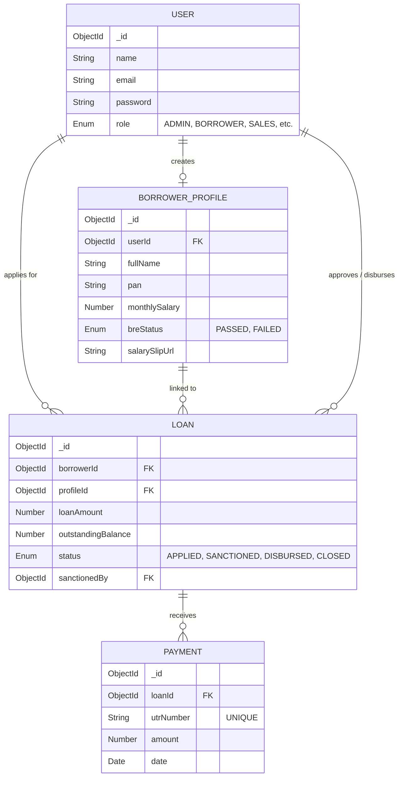

<div align="center">
  
  <h1>MoneyMint LMS</h1>
  <p><strong>Next-Generation Automated Lending Infrastructure</strong></p>
  <a href="https://money-mint-web.vercel.app/">View Live Project</a>
</div>

<br />

<!-- Demo video will be added here once recorded -->
<!-- [](YOUR_VIDEO_LINK_HERE) -->

MoneyMint is a full-stack Loan Management System designed to handle end-to-end institutional lending. I built it with a modern Borrower Portal for loan applications and a highly secure Operations Dashboard for internal executives to manage leads, sanction loans, disburse capital, and track repayments.

---

## Seed Script & Evaluator Credentials

To evaluate the role-based dashboard, you do not need to manually register multiple accounts. I have included a database seed script that injects test credentials for every role.

```bash
# Run this from the root directory or inside apps/api
bun run src/db/seed.ts
```

You can log into the live project using these pre-seeded accounts:

| Role | Email | Password | Access Level |
| :--- | :--- | :--- | :--- |
| **Admin** | `admin@moneymint.com` | `admin123` | Full Access across all dashboards |
| **Sales** | `sales@moneymint.com` | `sales123` | Lead generation and profile tracking |
| **Sanction** | `sanction@moneymint.com` | `sanction123` | Reviewing applications & Salary Slips |
| **Disbursement** | `disbursement@moneymint.com` | `disbursement123` | Disbursing approved capital |
| **Collection** | `collection@moneymint.com` | `collection123` | Recording UTRs and repayments |
| **Borrower** | `borrower@moneymint.com` | `borrower123` | Applying for and tracking loans |

---

## High-Level Architecture & AWS Integration

One of my critical design decisions in MoneyMint is how sensitive borrower documents are handled. Storing binary files (like PDFs) in MongoDB is an anti-pattern and degrades database performance. Instead, I implemented a highly secure AWS S3 architecture.

```mermaid
flowchart LR
	A[Borrower uploads salary slip] --> B[Frontend sends FormData to /api/borrower/salary-slip]
	B --> C[Multer checks file type and size]
	C --> D[File kept in memory as a buffer]
	D --> E[Backend creates S3 key: salary-slips/userId_timestamp.ext]
	E --> F[PutObjectCommand uploads to AWS S3]
	F --> G[Pre-signed URL generated for the file]
	G --> H[S3 key stored in MongoDB borrower profile]
	H --> I[Sanction team gets a fresh signed URL on each dashboard fetch]
```



**Design Choice:** By storing only the `s3://` URI string in MongoDB, my database remains lightweight and highly performant. By generating pre-signed URLs dynamically whenever a Sanction Executive views a profile, I guarantee that the bucket can remain completely private. No files are exposed to the public internet.

---

## Database Schema & Relationships

I designed a relational approach within MongoDB to keep data normalized across the lifecycle of a loan. 



**Schema Decisions:**
1. **Separation of Concerns:** The `USER` collection handles authentication. The `BORROWER_PROFILE` collection handles KYC and financials. This structure allows internal executives to exist as `USER`s without requiring a financial profile.
2. **Double Linking:** Loans reference both `borrowerId` and `profileId`. If a borrower updates their profile in the future, historical loans still point to the snapshot of their financial profile exactly as it was at the time of application.
3. **UTR Uniqueness:** The `PAYMENT` collection enforces a unique index on `utrNumber` to prevent double-spending or duplicate entry hacks in the collection dashboard.

---

## Project Flow Overview

The system is designed around a simple, strict lifecycle flow:

1. A borrower signs up or logs in.
2. The borrower fills in personal details.
3. The borrower uploads a salary slip.
4. The backend runs eligibility checks (BRE) and stores the file securely in AWS S3.
5. Internal teams review, sanction, disburse, and collect repayments.

## Project Structure

MoneyMint LMS is a monorepo containing two main applications:

- [apps/web](apps/web) - Frontend Next.js app for borrowers and internal teams
- [apps/api](apps/api) - Backend API that handles authentication, verification, and ledger logic
- [packages/ui](packages/ui) - Shared UI primitives
- [packages/eslint-config](packages/eslint-config) - Shared lint rules
- [packages/typescript-config](packages/typescript-config) - Shared TypeScript config
- [e2e-tests](e2e-tests) - End-to-end tests for auth, borrower, and dashboard flows

## Tech Stack

- **Frontend:** Next.js (App Router), React, TypeScript, Tailwind CSS
- **Backend:** Node.js, Express, Bun, TypeScript
- **Database:** MongoDB with Mongoose ORM
- **Authentication:** JWT (JSON Web Tokens) & bcrypt
- **Cloud/Storage:** AWS SDK (S3 Buckets, Pre-signed URLs), Multer
- **Architecture:** Turborepo, ESLint, Prettier

---

## API Communication

The frontend uses a highly modular fetch wrapper in [apps/web/app/lib/api.ts](apps/web/app/lib/api.ts).

That file reads `NEXT_PUBLIC_API_URL` from the environment. If it is not set, it falls back to my deployed Render backend URL. The wrapper dynamically appends the route path used by the app, such as `/auth/signin` or `/borrower/profile`.

The wrapper actively:
- Attaches the JWT token from `localStorage` as an `Authorization: Bearer` header.
- Handles `401 Unauthorized` responses by clearing local auth and redirecting the user safely back to `/login`.

---

## Backend API Endpoints

The backend logic resides in [apps/api/src/index.ts](apps/api/src/index.ts) and mounts routes under `/api`.

### Authentication Endpoints

Route file: [apps/api/src/routes/auth.ts](apps/api/src/routes/auth.ts)

| Method | Endpoint | Purpose |
| :--- | :--- | :--- |
| `POST` | `/api/auth/signup` | Create a borrower or executive account |
| `POST` | `/api/auth/signin` | Log in and receive a secure JWT token |

### Borrower Endpoints

Route file: [apps/api/src/routes/borrower.ts](apps/api/src/routes/borrower.ts)
All borrower routes require authentication and a strict `BORROWER` role.

| Method | Endpoint | Purpose |
| :--- | :--- | :--- |
| `POST` | `/api/borrower/profile` | Submit personal details and run strict BRE checks |
| `GET` | `/api/borrower/profile` | Fetch the borrower's saved profile |
| `POST` | `/api/borrower/salary-slip` | Upload salary slip directly to AWS S3 |
| `POST` | `/api/borrower/loan/apply` | Apply for a loan with simple interest mathematics |
| `GET` | `/api/borrower/loans` | List the borrower's loan history and status |

### Dashboard Endpoints

Route file: [apps/api/src/routes/dashboard.ts](apps/api/src/routes/dashboard.ts)
All dashboard routes require authentication and explicit role-based middleware guarding.

**Sales Dashboard (`SALES`, `ADMIN`)**

| Method | Endpoint | Purpose |
| :--- | :--- | :--- |
| `GET` | `/api/dashboard/sales/leads` | Show registered borrowers and track profile completion |

**Sanction Dashboard (`SANCTION`, `ADMIN`)**

| Method | Endpoint | Purpose |
| :--- | :--- | :--- |
| `GET` | `/api/dashboard/sanction/loans` | Fetch all APPLIED loans pending review |
| `PATCH` | `/api/dashboard/sanction/loans/:id/approve` | Transition an application to SANCTIONED |
| `PATCH` | `/api/dashboard/sanction/loans/:id/reject` | Transition an application to REJECTED (requires reason) |

**Disbursement Dashboard (`DISBURSEMENT`, `ADMIN`)**

| Method | Endpoint | Purpose |
| :--- | :--- | :--- |
| `GET` | `/api/dashboard/disbursement/loans` | Fetch all SANCTIONED loans awaiting capital release |
| `PATCH` | `/api/dashboard/disbursement/loans/:id/disburse` | Transition a loan to DISBURSED |

**Collection Dashboard (`COLLECTION`, `ADMIN`)**

| Method | Endpoint | Purpose |
| :--- | :--- | :--- |
| `GET` | `/api/dashboard/collection/loans` | Fetch all active DISBURSED loans |
| `POST` | `/api/dashboard/collection/loans/:id/payment` | Record a UTR-validated repayment against a loan balance |
| `GET` | `/api/dashboard/collection/loans/:id/payments` | View historical payment ledger for a specific loan |

---

## Detailed Salary Slip Upload Flow

The document ingestion engine is heavily optimized. Here is my exact implementation flow:

1. **Frontend Transmission:** The borrower uploads a file (PDF/JPG/PNG). The frontend forms a `FormData` payload and submits it under `salarySlip`.
2. **Middleware Interception:** The backend utilizes [upload.middleware.ts](apps/api/src/middlewares/upload.middleware.ts) to intercept the payload using Multer. It rejects unsupported MIME types and enforces a strict 5 MB file size limit, retaining the valid file purely in memory.
3. **AWS S3 PutObject:** The controller in [borrowerController.ts](apps/api/src/controllers/borrowerController.ts) generates a unique namespace key (`salary-slips/<userId>_<timestamp>.<ext>`) and pipes the memory buffer directly to AWS S3 using `PutObjectCommand`.
4. **Database Registration:** Once S3 acknowledges the upload, the backend stores only the S3 Key in the MongoDB profile.
5. **Pre-Signed Resolution:** When Sanction executives need to review the document, the backend requests a temporary (7-day) HTTPS Pre-Signed URL from AWS using the stored Key, ensuring zero public bucket exposure.

---

## Frontend Portals

I built the frontend entirely within Next.js, broken into two distinct portals: Borrower and Executive.

### Landing, Login, and Signup
- **`/`**: Public home page featuring marketing copy and a dynamic Simple Interest loan estimator.
- **`/login`** & **`/signup`**: Authentication gates that route users based on role (`/apply` for Borrowers, `/dashboard` for Executives).

### Borrower Journey
- **`/apply`**: Collects KYC fields (Full Name, PAN, DOB, Salary, Employment). Submitting triggers my Business Rule Engine (BRE) which requires minimum age and salary thresholds.
- **`/apply/salary-slip`**: The file upload gateway (only accessible if BRE passes).
- **`/apply/loan`**: The loan configuration engine allowing dynamic slider-based principal selection up to ₹5,00,000.
- **`/apply/status`**: The real-time tracking interface for submitted applications.

### Executive Dashboard
Executives land on **`/dashboard`**, which utilizes intelligent routing to redirect them exclusively to their permitted module:
- `/dashboard/sales`
- `/dashboard/sanction`
- `/dashboard/disbursement`
- `/dashboard/collection`

---

## Environment Configuration

### Backend
Create an `.env` file in `apps/api/src/config/`:
```env
DB_URL=mongodb+srv://<your-cluster-url>
JWT_SECRET=your_super_secret_key
AWS_REGION=ap-south-1
S3_BUCKET_NAME=your-bucket-name
AWS_ACCESS_KEY_ID=your-access-key
AWS_SECRET_ACCESS_KEY=your-secret-key
```

### Frontend
Create an `.env.local` file in `apps/web/`:
```env
# Point this to the backend base URL. For local dev, use http://localhost:5000
NEXT_PUBLIC_API_URL=https://moneymint-lms.onrender.com
```

---

## Local Development & Testing

From the repository root:

```sh
bun install
bun run dev
```

**Useful Commands:**
- `bun run build` - Execute Turbopack optimized builds across all packages
- `bun run lint` - Execute strict ESLint rules
- `bun run check-types` - Validate TypeScript compilation
- `bun test e2e-tests/auth.test.js` - Run the automated end-to-end testing suite

---

## Deployment Notes

### Frontend (Vercel)
The Next.js frontend is fully optimized for Vercel deployment.
1. Set the **Root Directory** to `apps/web`.
2. Set the **Framework Preset** to `Next.js`.
3. Set the Build Command to `bun run build`.
4. Inject the `NEXT_PUBLIC_API_URL` environment variable.

### Backend (Render)
The Express backend is deployed on Render as a Web Service.
1. Set the **Root Directory** to `apps/api`.
2. Set the Environment to `Bun`.
3. Set the **Build Command** to `bun install` and the **Start Command** to `bun run start`.
4. Inject the MongoDB and AWS environment variables into the Render console.

---

## Summary In Simple Terms

If you need the shortest possible explanation of my system:

1. The frontend securely communicates with the backend via a universal API interceptor.
2. The backend intercepts every request, verifying authentication tokens and strict role permissions.
3. Borrowers submit their financial profile and upload salary slips.
4. Salary slips bypass the database and are stored directly in AWS S3 for enterprise security.
5. Internal executives log into segmented dashboards to review, approve, disburse, and collect payments on those loans.
