# MoneyMint LMS

Live Project Link: https://moneymint-lms-web.vercel.app/

https://github.com/user-attachments/assets/51696c35-2d22-498a-9761-2ea1d357df4a

Seed script: `bun run src/db/seed.ts` from [apps/api](apps/api)

Seeded credentials:

- Admin: `admin@lms.com` / `admin123`
- Sales: `sales@lms.com` / `sales123`
- Sanction: `sanction@lms.com` / `sanction123`
- Disbursement: `disbursement@lms.com` / `disbursement123`
- Collection: `collection@lms.com` / `collection123`

AWS salary slip upload architecture:

```mermaid
flowchart LR
	A[Borrower uploads salary slip in frontend] --> B[Frontend sends FormData to /api/borrower/salary-slip]
	B --> C[Multer middleware checks file type and size]
	C --> D[File stays in memory as a buffer]
	D --> E[Backend creates S3 key: salary-slips/userId_timestamp.ext]
	E --> F[PutObjectCommand uploads file to AWS S3]
	F --> G[HeadObjectCommand confirms the upload]
	G --> H[Backend saves the S3 URL in the borrower profile]
	H --> I[Sanction team can open the salary slip from the dashboard]
```



In simple words, the file does not go directly to the database. It goes from the frontend to the backend, then the backend stores it in AWS S3 and saves only the file URL in MongoDB.

MoneyMint LMS is a monorepo loan management system with two main apps:

- A Next.js frontend for borrowers and internal teams
- An Express + Bun backend API that handles authentication, borrower verification, loan processing, and payment tracking

The system is designed around a simple flow:

1. A borrower signs up or logs in.
2. The borrower fills in personal details.
3. The borrower uploads a salary slip.
4. The backend runs eligibility checks and stores the file in AWS S3.
5. Internal teams review, sanction, disburse, and collect repayments.

## Project Structure

- [apps/web](apps/web) - Frontend Next.js app
- [apps/api](apps/api) - Backend API
- [packages/ui](packages/ui) - Shared UI primitives
- [packages/eslint-config](packages/eslint-config) - Shared lint rules
- [packages/typescript-config](packages/typescript-config) - Shared TypeScript config
- [e2e-tests](e2e-tests) - End-to-end tests for auth, borrower, and dashboard flows

## Tech Stack

- Frontend: Next.js, React, TypeScript
- Backend: Express, Bun, TypeScript
- Database: MongoDB with Mongoose
- Authentication: JWT
- File Uploads: Multer + AWS SDK + S3
- Repo tooling: Turborepo, ESLint, Prettier

## How the Frontend Talks to the Backend

The frontend uses a single fetch wrapper in [apps/web/app/lib/api.ts](apps/web/app/lib/api.ts).

That file reads `NEXT_PUBLIC_API_URL` from the environment. If it is not set, it falls back to the deployed Render backend URL. The wrapper then appends the route path used by the app, such as:

- `/auth/signin`
- `/borrower/profile`
- `/dashboard/sales/leads`

So the final request becomes something like:

`https://your-backend-domain/api/auth/signin`

The wrapper also:

- Adds the JWT token from `localStorage` as an `Authorization: Bearer ...` header
- Sends JSON when needed
- Handles `401 Unauthorized` by clearing local auth and sending the user back to `/login`

## Backend API Overview

The backend lives in [apps/api/src/index.ts](apps/api/src/index.ts) and mounts routes under `/api`.

### Base URL

All backend endpoints are prefixed with:

`/api`

Examples:

- `GET /api/health`
- `POST /api/auth/signup`
- `GET /api/borrower/profile`

### Authentication Endpoints

Route file: [apps/api/src/routes/auth.ts](apps/api/src/routes/auth.ts)

| Method | Endpoint | Purpose |
| --- | --- | --- |
| `POST` | `/api/auth/signup` | Create a borrower account |
| `POST` | `/api/auth/signin` | Log in and receive a JWT token |

What they return:

- A `token`
- A `user` object with `id`, `name`, `email`, and `role`

The implementation is in [apps/api/src/controllers/authController.ts](apps/api/src/controllers/authController.ts).

### Borrower Endpoints

Route file: [apps/api/src/routes/borrower.ts](apps/api/src/routes/borrower.ts)

All borrower routes require:

- Authentication
- `BORROWER` role

| Method | Endpoint | Purpose |
| --- | --- | --- |
| `POST` | `/api/borrower/profile` | Submit personal details and run BRE checks |
| `GET` | `/api/borrower/profile` | Fetch the borrower’s saved profile |
| `POST` | `/api/borrower/salary-slip` | Upload salary slip to AWS S3 |
| `POST` | `/api/borrower/loan/apply` | Apply for a loan |
| `GET` | `/api/borrower/loans` | List the borrower’s loans |

The implementation is in [apps/api/src/controllers/borrowerController.ts](apps/api/src/controllers/borrowerController.ts).

### Dashboard Endpoints

Route file: [apps/api/src/routes/dashboard.ts](apps/api/src/routes/dashboard.ts)

All dashboard routes require authentication, and most also require a specific executive role.

#### Sales

| Method | Endpoint | Purpose |
| --- | --- | --- |
| `GET` | `/api/dashboard/sales/leads` | Show registered borrowers and their profile status |

Allowed roles: `SALES`, `ADMIN`

#### Sanction

| Method | Endpoint | Purpose |
| --- | --- | --- |
| `GET` | `/api/dashboard/sanction/loans` | Show applied loans ready for review |
| `PATCH` | `/api/dashboard/sanction/loans/:id/approve` | Approve a loan |
| `PATCH` | `/api/dashboard/sanction/loans/:id/reject` | Reject a loan with a reason |

Allowed roles: `SANCTION`, `ADMIN`

#### Disbursement

| Method | Endpoint | Purpose |
| --- | --- | --- |
| `GET` | `/api/dashboard/disbursement/loans` | Show sanctioned loans waiting for payment |
| `PATCH` | `/api/dashboard/disbursement/loans/:id/disburse` | Mark a loan as disbursed |

Allowed roles: `DISBURSEMENT`, `ADMIN`

#### Collection

| Method | Endpoint | Purpose |
| --- | --- | --- |
| `GET` | `/api/dashboard/collection/loans` | Show active disbursed loans |
| `POST` | `/api/dashboard/collection/loans/:id/payment` | Record a repayment |
| `GET` | `/api/dashboard/collection/loans/:id/payments` | View payment history for a loan |

Allowed roles: `COLLECTION`, `ADMIN`

The implementation is in [apps/api/src/controllers/dashboardController.ts](apps/api/src/controllers/dashboardController.ts).

## Salary Slip Upload Flow

The salary slip upload is one of the most important parts of the project.

### 1. The frontend sends a file

The borrower uploads a file from the salary slip page in the frontend. The request uses `FormData` and sends the file under the field name `salarySlip`.

### 2. Multer accepts the file in memory

The backend uses [apps/api/src/middlewares/upload.middleware.ts](apps/api/src/middlewares/upload.middleware.ts).

This middleware:

- Accepts `PDF`, `JPG`, and `PNG`
- Rejects unsupported file types
- Limits file size to 5 MB
- Uses memory storage so the file buffer is available immediately

### 3. The controller uploads to S3

In [apps/api/src/controllers/borrowerController.ts](apps/api/src/controllers/borrowerController.ts), the file is:

- Read from memory as a buffer
- Given a generated key like `salary-slips/<userId>_<timestamp>.<ext>`
- Sent to AWS S3 with `PutObjectCommand`
- Verified with `HeadObjectCommand`

### 4. The borrower profile is updated

After upload, the backend creates a public S3 URL and saves it to the borrower profile.

The response includes:

- `salarySlipUrl`
- `location`
- `bucket`
- `key`
- `verified: true`

### 5. The frontend uses that URL later

The sanction dashboard shows the salary slip link so executives can review the uploaded document before approving the loan.

### S3 Configuration

The S3 client is defined in [apps/api/src/config/s3.ts](apps/api/src/config/s3.ts).

Required env vars:

- `S3_BUCKET_NAME`
- `AWS_REGION`
- `AWS_ACCESS_KEY_ID`
- `AWS_SECRET_ACCESS_KEY`

## Frontend Pages

The frontend is a borrower and executive portal built in [apps/web](apps/web).

### Landing Page

- Route: `/`
- File: [apps/web/app/page.tsx](apps/web/app/page.tsx)

This is the public home page. It includes:

- A loan estimator
- Marketing content
- Entry points to sign up and log in

Clicking the MoneyMint logo returns to this page.

### Login and Signup

- Login route: `/login`
- Signup route: `/signup`

Files:

- [apps/web/app/login/page.tsx](apps/web/app/login/page.tsx)
- [apps/web/app/signup/page.tsx](apps/web/app/signup/page.tsx)

These pages use the auth context in [apps/web/app/lib/auth.tsx](apps/web/app/lib/auth.tsx).

What happens after login:

- Borrowers go to `/apply`
- Executives go to `/dashboard`

### Borrower Journey

#### 1. Personal details

- Route: `/apply`
- File: [apps/web/app/apply/page.tsx](apps/web/app/apply/page.tsx)

The borrower enters:

- Full name
- PAN
- Date of birth
- Monthly salary
- Employment mode

This submits to `POST /api/borrower/profile` and triggers BRE validation.

#### 2. Salary slip upload

- Route: `/apply/salary-slip`
- File: [apps/web/app/apply/salary-slip/page.tsx](apps/web/app/apply/salary-slip/page.tsx)

The borrower uploads the salary slip after the personal details pass the BRE checks.

#### 3. Loan application

- Route: `/apply/loan`
- File: [apps/web/app/apply/loan/page.tsx](apps/web/app/apply/loan/page.tsx)

The borrower chooses a loan amount and tenure and submits the application.

#### 4. Loan status

- Route: `/apply/status`
- File: [apps/web/app/apply/status/page.tsx](apps/web/app/apply/status/page.tsx)

This shows the borrower’s submitted loans and their current status.

### Executive Dashboard

Executives land on `/dashboard`, which redirects to the correct module based on role.

File: [apps/web/app/dashboard/page.tsx](apps/web/app/dashboard/page.tsx)

Modules:

- Sales: [apps/web/app/dashboard/sales/page.tsx](apps/web/app/dashboard/sales/page.tsx)
- Sanction: [apps/web/app/dashboard/sanction/page.tsx](apps/web/app/dashboard/sanction/page.tsx)
- Disbursement: [apps/web/app/dashboard/disbursement/page.tsx](apps/web/app/dashboard/disbursement/page.tsx)
- Collection: [apps/web/app/dashboard/collection/page.tsx](apps/web/app/dashboard/collection/page.tsx)

### Shared UI Behavior

The main shell components live in [apps/web/app/components](apps/web/app/components).

Notable pieces:

- [Navbar.tsx](apps/web/app/components/Navbar.tsx) for top-level navigation
- [Sidebar.tsx](apps/web/app/components/Sidebar.tsx) for dashboard navigation
- [Toast.tsx](apps/web/app/components/Toast.tsx) for success and error messages
- [LoadingSpinner.tsx](apps/web/app/components/LoadingSpinner.tsx) for pending states

## Environment Variables

### Backend

The backend reads these values:

- `DB_URL`
- `JWT_SECRET`
- `AWS_REGION`
- `S3_BUCKET_NAME`
- `AWS_ACCESS_KEY_ID`
- `AWS_SECRET_ACCESS_KEY`

The example file is [apps/api/src/config/.env.example](apps/api/src/config/.env.example).

### Frontend

The frontend reads:

- `NEXT_PUBLIC_API_URL`

The value should point to the backend base URL, for example:

`https://moneymint-lms.onrender.com`

The frontend code automatically appends `/api` when needed.

## Local Development

From the repository root:

```sh
bun install
bun run dev
```

Useful scripts:

- `bun run build` - build all apps
- `bun run lint` - lint the workspace
- `bun run check-types` - run type checks
- `bun test e2e-tests/auth.test.js` - run the auth e2e suite

## Deployment Notes

- Frontend can be deployed on Vercel
- Backend is deployed on Render in this setup
- The frontend should use `NEXT_PUBLIC_API_URL` to point to the deployed backend
- The backend must have MongoDB and AWS credentials configured in Render environment variables

## In Simple Terms

If you want the shortest possible explanation:

1. The frontend sends requests to the backend using a shared API helper.
2. The backend checks authentication and role permissions.
3. Borrowers submit profile data and upload salary slips.
4. Salary slips are stored in AWS S3.
5. Executives review, approve, disburse, and collect loans from the dashboard.
